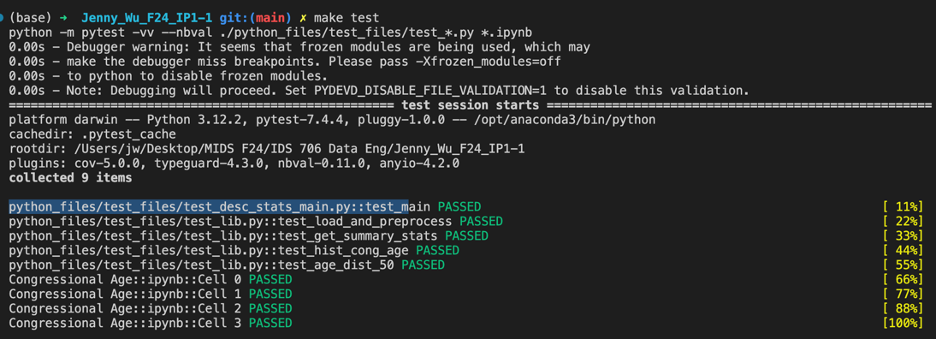

# Jenny_Wu_IP1_F24
F24 Individual Project 1

Please see below for the video explaination of the project. 

https://youtu.be/JgE3sMuWBMs

### Purpose of Project
The purpose of this project is to utilize continuous integration using Gitlab actions of Python to conduct descriptive analysis. I used the FiveThirtyEight's Congress dataset on the age of Congress members to produce sample descriptive statistics and visualizations.

### Requirements
The project structure must include the following files:
    Jupyter Notebook with: 
        - Cells that perform descriptive statistics using Polars or Panda.
        - Tested by using nbval plugin for pytest
    Makefile with the following:
        - Run all tests (must test notebook and script and lib)
        - Formats code with Python blackLinks to an external site.
        - Lints code with RuffLinks to an external site.
        - Installs code via:  pip install -r requirements.txt
    test_script.py to test script
    test_lib.py to test library
    Pinned requirements.txt
    Gitlab Actions performs all four Makefile commands with badges for each one in the README.md

### Project Organization 
    .dev container
    - devcontainter.json
    - Dockerfile
    .github 
        workflows
            - format.yml
            - install.yml
            - lint.yml
            - test.yml
    output
        - chamber_age.png
        - congressional_age.png
    python_files
        main_files
            - desc_stats_main.py
            - lib.py
        test_files
            - test_desc_stats_main.py
            - test_lib.py
        cong_age_summary.md
        Congressional Age.ipynb
    Makefile
    README.md
    requirements.txt

### Dataset Description
The dataset used for this project is the data behind FiveThirtyEight's [Congress Today Is Older Than It’s Ever Been](https://fivethirtyeight.com/features/aging-congress-boomers/), by Geoffrey Skelley (April 3, 2023).

`data_aging_congress.csv` contains information about the age of every member of the U.S. Senate and House from the 66th Congress (1919-1921) to the 118th Congress (2023-2025). Data is as of March 29, 2023, and is based on all voting members who served in either the Senate or House in each Congress. The data excludes delegates or resident commissioners from non-states. Any member who served in both chambers in the same Congress was assigned to the chamber in which they cast more votes. The dataset begins with the 66th Congress because it was the first Congress in which all senators had been directly elected, rather than elected by state legislatures, following the [ratification of the 17th Amendment in 1913](https://constitutioncenter.org/the-constitution/amendments/amendment-xvii). 

| Header | Description | Source(s) | 
| ----- | ------------ | ------ |
| `congress` | The number of the Congress that this member’s row refers to. For example, `118` indicates the member served in the 118th Congress (2023-2025). | [Biographical Directory of the United States Congress](https://bioguide.congress.gov/); [VoteView.com](https://voteview.com/) | 
| `start_date` | First day of a Congress. For the 66th Congress to the 73rd Congress, this was March 4. With the [ratification of the 20th Amendment](https://constitutioncenter.org/the-constitution/amendments/amendment-xx), Congress’s start date shifted to Jan. 3 for the 74th Congress to present. | U.S. House of Representatives | 
| `chamber` | The chamber a member of Congress sat in: `Senate` or `House`. Any member who served in both chambers in the same Congress — e.g., a sitting representative who was later appointed to the Senate — was assigned to the chamber in which they cast more votes. | [Biographical Directory of the United States Congress](https://bioguide.congress.gov/); [VoteView.com](https://voteview.com/) | 
| `state_abbrev` | The [two-letter postal abbreviation](https://www.bls.gov/respondents/mwr/electronic-data-interchange/appendix-d-usps-state-abbreviations-and-fips-codes.htm) for the state a member represented. | [Biographical Directory of the United States Congress](https://bioguide.congress.gov/); [VoteView.com](https://voteview.com/) | 
| `party_code` | A code that indicates a member’s party, based on the system used by the [Inter-university Consortium for Political and Social Research](https://www.icpsr.umich.edu/web/ICPSR/studies/07757/datasets/0001/variables/V13?archive=ICPSR). The most common values will be `100` for Democrats, `200` for Republicans and `328` for independents. See [VoteView.com’s full list](https://voteview.com/articles/data_help_parties) for other party codes. If a member switched parties amid a Congress, they are listed with the party they identified with during the majority of their votes. | [VoteView.com](https://voteview.com/) | 
| `bioname` | Full name of member of Congress. | [Biographical Directory of the United States Congress](https://bioguide.congress.gov/); [VoteView.com](https://voteview.com/) | 
| `bioguide_id` | Code used by the Biographical Directory of the United States Congress to uniquely identify each member. | [Biographical Directory of the United States Congress](https://bioguide.congress.gov/); [VoteView.com](https://voteview.com/) | 
| `birthday` | Date of birth for a member. | [UnitedStates GitHub](https://github.com/unitedstates/congress-legislators); [Biographical Directory of the United States Congress](https://bioguide.congress.gov/) | 
| `cmltv_cong` | The cumulative number of Congresses a member has or had served in (inclusive of listed `congress`), regardless of whether the member was in the Senate or House. E.g. `1` indicates it’s a member’s first Congress. | [Biographical Directory of the United States Congress](https://bioguide.congress.gov/); [VoteView.com](https://voteview.com/) | 
| `cmltv_chamber` | The cumulative number of Congresses a member has or had served in a `chamber` (inclusive of listed `congress`). E.g. a senator with a `1` indicates it’s the senator’s first Congress in the Senate, regardless of whether they had served in the House before. | [Biographical Directory of the United States Congress](https://bioguide.congress.gov/); [VoteView.com](https://voteview.com/) | 
| `age_days` | Age in days, calculated as `start_date` minus `birthday`. | |
| `age_years` | Age in years, calculated by dividing `age_days` by `365.25`. | | 
| `generation` | Generation the member belonged to, based on the year of birth. Generations in the data are defined as follows: Gilded (1822-1842), Progressive (1843-1859), Missionary (1860-1882), Lost (1883-1900), Greatest (1901-1927), Silent (1928-1945), baby boomer (1946-1964), Generation X (1965-1980), millennial (1981-1996), Generation Z (1997-2012).   Note: Baby boomers are listed as `Boomers`, Generation X as `Gen X`, millennials as `Millennial` and Generation Z as `Gen Z`. | Pew Research Center for definitions of [Greatest Generation](https://www.pewresearch.org/politics/2016/12/15/americans-name-the-10-most-significant-historic-events-of-their-lifetimes/) to [Generation Z](https://www.pewresearch.org/fact-tank/2020/04/28/millennials-overtake-baby-boomers-as-americas-largest-generation/); [Strauss and Howe](https://journals.sagepub.com/doi/abs/10.1177/153660069301400207?journalCode=jhra) (1991) for definitions for Gilded to Lost generations. | 
