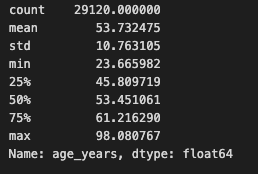

# Jenny_Wu_F24_MP9
F24 Mini Project 9: Create a Cloud-Based Notebook 
Link to Google Collab Notebook: https://colab.research.google.com/drive/1mMxeivIyYwOAjxei6q3PW0ouznhtrHMW?usp=sharing

### Purpose of Project
This repository is created to fulfill an assignments in the Data Engineering course, IDS 706. The aim is to create 
1. Cloud-Hosted Notebook .
1. Perform Data Manipulation.

### Requirements
- [x] Set up a cloud-hosted Jupyter Notebook (e.g., Google Colab)
- [x] Perform data manipulation tasks on a sample dataset
- [x] Setup and configuration (20 points)
- [x] Data manipulation tasks (20 points)
- [x] CI/CD pipeline (10 points)
- [x] Link to the cloud-hosted notebook
- [x] Document or video demonstrating the tasks performed
   
### Dataset Description
The dataset used for this project is the data behind FiveThirtyEight's [Congress Today Is Older Than It’s Ever Been](https://fivethirtyeight.com/features/aging-congress-boomers/), by Geoffrey Skelley (April 3, 2023).

`data_aging_congress.csv` contains information about the age of every member of the U.S. Senate and House from the 66th Congress (1919-1921) to the 118th Congress (2023-2025). Data is as of March 29, 2023, and is based on all voting members who served in either the Senate or House in each Congress. The data excludes delegates or resident commissioners from non-states. Any member who served in both chambers in the same Congress was assigned to the chamber in which they cast more votes. The dataset begins with the 66th Congress because it was the first Congress in which all senators had been directly elected, rather than elected by state legislatures, following the [ratification of the 17th Amendment in 1913](https://constitutioncenter.org/the-constitution/amendments/amendment-xvii). 

### Steps
1. Prepare the necesary configuration files like the Dockerfile, devcontainer.json, Makefile, requirements.txt, and main.yml for GitHub Actions integration. Ensure that the requirements.txt lists all necessary packages.
2. Navigate to Google Colab and create a new Jupyter notebook called Congressional_Age.ipynb. This is where all of your data ingestion, exploration, and manipulation code will go. 
3. Include basic tests of the main script in the test_lib.py file to ensure that its functionalities are working as expected.

### Results 
In this notebook, we created a function to read the csv and to pull a table of descriptive statistics on the variable "age_years", which is the age of every Congressmember when they entered their position. This function takes in the input of the dataset and the variable column of choice. As we see here, the age of an average Congressmember is 53.7 years old and the oldest serving Congressmember was 98 years old. 

Following the descriptive statistics, we created two charts to depict the ages of all Congressmemebers and the distribution of ages across both chambers of Congress.

