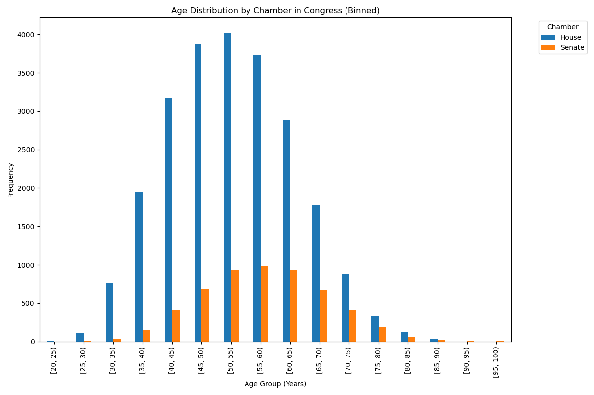

Describe:
|       |   age_years |
|:------|------------:|
| count |  29120      |
| mean  |     53.7325 |
| std   |     10.7631 |
| min   |     23.666  |
| 25%   |     45.8097 |
| 50%   |     53.4511 |
| 75%   |     61.2163 |
| max   |     98.0808 |

